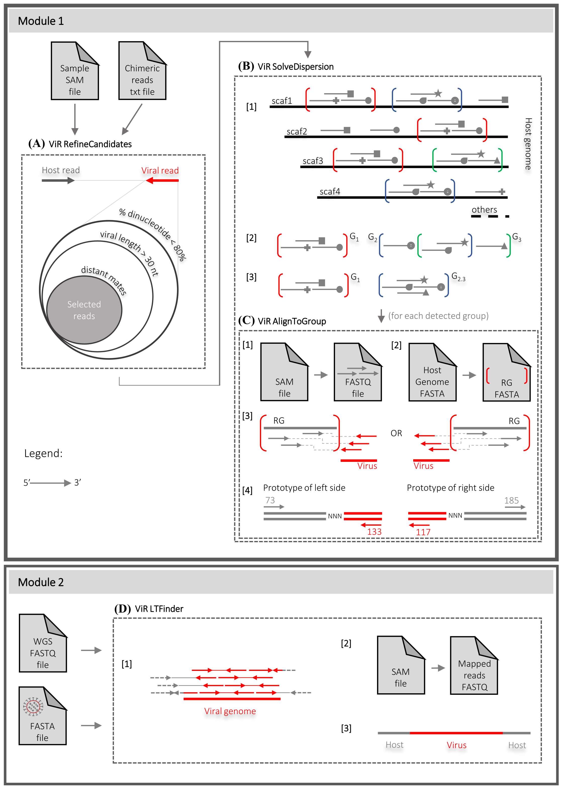

# ViR
Pipeline developped by Elisa Pischedda, while in the Bonizzoni Lab at the University of Pavia (Italy).

[see the ViR paper in Biorxiv: Pischedda et al., 2020](https://www.biorxiv.org/content/10.1101/2020.06.16.155119v1 "ViR paper")

## Purpose
ViR is designed to solve the dispersion of reads due to intrasample variability for a reliable identification of lateral gene transfer events, with a focus on viral integrations. Repetitive elements and/or fragmentation of a genome assembly result in intra-host variability leading to dispersion of reads across sequence-identical regions of the genome (here after called 'equivalent regions') when mapping short paired end reads to predict sites of an integration event. ViR solve the dispersions of reads by recognizing the membership of spared chimeric reads across equivalent genomic region and reconstructing the insertion site, based on available reads.



ViR is composed of four scripts, which work in two modules. The first three scripts ```"ViR_RefineCandidates.sh"```, ```"ViR_SolveDispersion.sh"``` and ```"ViR_AlignToGroup.sh"``` work together to overcome the dispersion of reads due to intrasample variability (module 1). ```"ViR_LTFinder.sh"``` is designed to run independently from the others, when testing for integration events of non-host sequences which have none or limited (threshold defined by the user) sequence similarity to sequences of the host (module 2).

## Installation

### Dependencies
ViR uses the following programs, which need to be installed and their path reported as values of the input parameters of the scripts.

* PYTHON 2.7 https://www.python.org/download/releases/2.7/
* BEDTOOLS v2.25.0 https://github.com/arq5x/bedtools2/releases
* SAMTOOLS 1.4 https://sourceforge.net/projects/samtools/files/samtools/1.4/
* BLAST 2.6.0 ftp://ftp.ncbi.nlm.nih.gov/blast/executables/blast+/LATEST/
* BWA 0.7.15-r1140 https://github.com/lh3/bwa/releases
* TRINITY v2.7.0-PRERELEASE https://github.com/trinityrnaseq/trinityrnaseq/releases


- - - -

<br>

## Module-1: ```"ViR_RefineCandidates.sh"```

<br>

### Files preparation

Needed:

1. __A sam file (SAM)__ generated by the alignment of the raw reads of the sample against the host reference genome. The path of the sam file must be used as value of the parameter `-sam_file` in ```"ViR_RefineCandidates.sh"``` script;

2. __A tab separated table of the chimeric reads (TXT)__. Examples are available in the folder "example_data". The path of the text file must be used as value of the parameter `-chimeric_reads_file` in ```"ViR_RefineCandidates.sh"``` script. Example:
```
#SAMPLE_ID	READ_ID	HR_CHR	HR_START	HR_MQ	VR_SEQ	VIRUS_ID	VIRUS_START	VIRUS_END	VIRAL_SEQ
SSR4	E00338:95:HGNWJCCXY:1:1221:16640:64984	NW_021838865.1	556999	0	GTCATTGCCGCCATCATCAACGGCATTGAGTGGATCCGTGGCATGGGTGAGTGCCGTTTTTTTTTTTTTTTTTTTTTTTTTTTTTCTTTTTAAACATAGGGGGGTAATCTTCCCCCACGAACCCCCAAAAGAAAGGTTTGGTTGTGTCGGG	NC_043569.1	826	863	TTTTTTTTTTTTTTTTTTTTTTTTTTTTCTTTTTAAA
```

3. __Host reference genome (FASTA)__ in fasta format. The path of the fasta file must be used as value of the parameter `-reference_fasta` in ```"ViR_RefineCandidates.sh"``` script. The BLAST database of the fasta file is needed; you can produce it with the following command:
```sh
/absolute_path_to/ncbi-blast-XXX+/bin/makeblastdb -in /absolute_path_to/Host_Reference_Genome.fasta -dbtype nucl
```

<br>

### Paramters
Fill the appropriated parameter values; absolute paths will allow to run ```"ViR_RefineCandidates.sh"``` from any directory.

| parameter name                          | description                                                        | default |
|-----------------------------------------|--------------------------------------------------------------------|---------|
| work_files_dir                          | absolute path of ViR directory                                     |         |
| sample_name                             | name of the sample                                                 |         |
| sam_file                                | absolute path of the SAM file                                      |         |
| chimeric_reads_file                     | absolute path of the tab separated table of the chimeric reads     |         |
| out                                     | absolute path of the output directory                              |         |
| max_percentage_dinucleotide_in_ViralSeq | maximum percentage of dinucleotide accepted in the viral sequence  | 0.8     |
| minimum_virus_len                       | minimum length of the viral sequence                               | 30      |
| reference_fasta                         | absolute path of the host reference genome                         |         |
| path_to_blastn                          | absolute path of blastn executable                                 |         |
| path_to_bedtools                        | absolute path of bedtools executable                               |         |
| blastn_evalue                           | maximum evalue for the reads alignment                             | 1e-15   |
| min_mate_distance                       | minimum distance between mates to be maintained                    | 10000   |

<br>

### Running

Run the following command:
```sh
nohup bash /absolute_path_to/VIR-master/ViR_RefineCandidates.sh \
-work_files_dir /absolute_path_to/VIR-master/ \
-sample_name SAMPLE_ID \
-sam_file /absolute_path_to/sample_file.sam \
-chimeric_reads_file /absolute_path_to/sample_chimeric_reads.txt \
-out /absolute_path_to/output_directory_refineCandidates \
-max_percentage_dinucleotide_in_ViralSeq 0.8 \
-minimum_virus_len 30 \
-reference_fasta /absolute_path_to/Host_reference_genome.fasta \
-path_to_blastn /absolute_path_to/blastn \
-path_to_bedtools /absolute_path_to/bedtools \
-blastn_evalue 1e-15 \
-min_mate_distance 10000 &
```

<br>

### Output

```"ViR_RefineCandidates.sh"``` outputs three files: ```"Final_ChimericPairs_Info.txt"```, ```"Final_HostReads.fasta"``` and ```"Final_ViralReads.fasta"```

1. The ```"Final_ChimericPairs_Info.txt"``` is a tab delimited file including the following columns for the chimeric reads passing the filters;
```
# SAMPLE_ID	READ_ID	HR_CHR	HR_START	HR_END	HR_SEQ	HR_FLAG	HR_NT_BQ20	HR_MQ	VR_SEQ	VR_FLAG	VR_NT_BQ20	VIRUS_ID	VIRUS_START	VIRUS_END	VIRUS_SEQ	VIRUS_SEQ_LEN	VR_AlignToRef?
SSR4	E00338:95:HGNWJCCXY:4:1122:28716:42481	NW_021837046.1	23938349	23938500	TGTTCTGGGCGGTGGAACGCCATCAGAAAGTTTTGTCCGCTTGCCTCGAAGCCGTAGCAGCATCAGTATTGTTGGGGGCGTATCGCGGCGTGATCCAAGATCTTCCGCCCGAAGTTTTGGTATTCTGTCTGACAATGGGGTGGAAGACGTC	73	147	0	GCTGCCACCGTCGGATGATTGGCTCTCTCTGCGGCCCAGATAGCCCCAGCGCTCGCTAAGGACACAGTCCAAAACCACACGTTCATTCCAGAGTCGCTGAATGAGCTCTTGGGCTCGCGCCAATTCCACACGAATCTGTAGAGCACGTTC	133	135	M91671.1	4038	4071	CCCAGCGCTCGCTAAGGACACAGTCCAAAACCA	33	Yes
```
2. The fasta file of the host reads in the sample, ```"Final_HostReads.fasta"```;

3. The fasta file of the viral reads in the sample, ```"Final_ViralReads.fasta"```.

- - - -

<br>

## Module-1: ```"ViR_SolveDispersion.sh"```
### (including ```"ViR_AlignToGroup.sh"```)

<br>

### Files preparation

The followings are needed:

1. __The output directory of ViR_RefineCandidates (DIRECTORY)__ which has been used as value of the parameter `-out` in ```"ViR_RefineCandidates.sh"```. This directory has to be set as value of `-outdict_RefCand` in ```"ViR_SolveDispersion.sh"```;

2. __The list of the samples(TXT)__ to analyze together. The path of the text file must be used as value of the parameter `-sample_list` in ```"ViR_SolveDispersion.sh"``` script. A single or multiple samples can be used at the same time. Examples are available in the folder "example_data";

3. __Host reference genome (FASTA)__ in fasta format. The path of the fasta file must be used as value of the parameter `-reference_fasta` in ```"ViR_SolveDispersion.sh"``` script;

4. OPTIONAL __Transposable elements (FASTA)__ in fasta format. The path of the fasta file must be used as value of the parameter `-repreg_fasta` in ```"ViR_SolveDispersion.sh"``` script. If `-repreg_fasta` is used, also set the `-min_TE_al_length` parameter. The BLAST database of the fasta file is needed; you can produce it with the following command:
```sh
/absolute_path_to/ncbi-blast-XXX+/bin/makeblastdb -in /absolute_path_to/Transposable_elements.fasta -dbtype nucl
```

5. OPTIONAL __Bed file of the annotated EVEs (BED)__ in the reference genome. The path of the bed file must be used as value of the parameter `-bed_EVE_annotated` in ```"ViR_SolveDispersion.sh"``` script. If `-bed_EVE_annotated` is used, also set the `-eve_dist` parameter;

6. OPTIONAL __Bed file of the annotated piwi clusters (BED)__ in the reference genome. The path of the fasta file must be used as value of the parameter `-bed_piwi_clusters` in ```"ViR_SolveDispersion.sh"``` script. If `-bed_piwi_clusters` is used, also set the `-piwi_dist` parameter.

<br>

### Paramters
Fill the appropriated parameter values; it is suggest to use absolute paths to allow you to run ```"ViR_SolveDispersion.sh"``` from any directory.

| parameter name                          | description                                                                                           | default |
|-----------------------------------------|-------------------------------------------------------------------------------------------------------|---------|
| work_files_dir                          | absolute path of ViR directory                                                                        |         |
| outdict_RefCand                         | absolute path of ViR_RefineCandidates output directory                                                |         |
| analysis_name                           | name of the analysis                                                                                  |         |
| sample_list                             | absolute path of the file including the list of the sample to analyze                                 |         |
| out                                     | absolute path of the output directory                                                                 |         |
| reference_fasta                         | absolute path of the host reference genome                                                            |         |
| repreg_fasta                            | absolute path of the repeated element fasta file                                                      |         |
| min_TE_al_length                        | minimum alignment length in bp of a repeated element in the host genome                               | 100     |
| bed_EVE_annotated                       | absolute path pf the bed file of the annotated EVEs in the host genome                                |         |
| eve_dist                                | minimum distance in bp between the candidate integration and an EVE annotated to be reported          | 10000   |
| bed_piwi_clusters                       | absolute path of the bed file of the piwi clusters annotated in the host genome                       |         |
| piwi_dist                               | minimum distance in bp between the candidate integration and a piwi cluster annotated to be reported  | 0       |
| path_to_blastn                          | absolute path of blastn executable                                                                    |         |
| path_to_bedtools                        | absolute path of bedtools executable                                                                  |         |
| trinity_exe                             | absolute path of trinity executable                                                                   |         |
| samtools_exe                            | absolute path of samtools executable                                                                  |         |
| bwa_exe                                 | absolute path of bwa executable                                                                       |         |
| merge_dist                              | maximum distance in bp between aligned reads to be considered in the same read group                  | 1000    |
| minReads_inRegion                       | minimum number of reads in a read group                                                               | 2       |
| percReadsShared_inGroup_union           | minimum percentage of reads shared by two read groups to be merged                                    | 0.8     |

<br>

### Running

Run the following command:
```sh
nohup bash /absolute_path_to/VIR-master/ViR_SolveDispersion.sh \
-work_files_dir /absolute_path_to/VIR-master/ \
-outdict_RefCand /absolute_path_to/output_directory_refineCandidates \
-analysis_name SAMPLE_ID \
-sample_list /absolute_path_to/sample_list.list \
-out /absolute_path_to/output_directory_solveDispersion \
-reference_fasta /absolute_path_to/Host_Reference_Genome.fa \
-repreg_fasta /absolute_path_to/Transposable_elements.fa \
-min_TE_al_length 100 \
-bed_EVE_annotated /absolute_path_to/EVEs.bed \
-eve_dist 10000 \
-bed_piwi_clusters /absolute_path_to/piwiClusters.bed \
-piwi_dist 0 \
-path_to_blastn /absolute_path_to/blastn \
-path_to_bedtools /absolute_path_to/bedtools \
-trinity_exe /absolute_path_to/Trinity \
-samtools_exe /absolute_path_to/samtools \
-bwa_exe /absolute_path_to/bwa \
-merge_dist 1000 \
-minReads_inRegion 2 \
-percReadsShared_inGroup_union 0.8 &
```

<br>

### Output

```"ViR_SolveDispersion.sh"``` outputs five files ( ```"All_Equivalent_Regions_per_Read_Group.txt"```, ```"Complete_Dataset_Info.txt"```, ```"Complete_Read_Groups_Info.txt"```, ```"Equivalent_region_per_Read_Group.fasta"``` and ```"Equivalent_region_per_Read_Group_sorted.bed"```) and a directory named 'RG':

1. The ```"All_Equivalent_Regions_per_Read_Group.txt"``` includes for each read groups found in the sample, the list of the read ids in the group and all the equivalent regions in the genome in which the reads have an alignements. Usually, equivalent regions are repetivive elements in the genome;

2. The ```"Complete_Dataset_Info.txt"``` is the same as ```"Final_ChimericPairs_Info.txt"``` plus a column including the read group assigned to the read pair. If there is not a group, the read pair is tagged as 'Ungrouped';

3. The ```"Complete_Read_Groups_Info.txt"``` is a tab delimited file including the description of the integration site and the related boundaries region. For each sample, the number of reads belonging from each group is reported. Example:
```
READ_GROUP	SCAFFOLD	START	END	LENGHT	NUM_EQ_RG	near/in_EVEs	in_PIRCS	near_TE	VIRUS_ID	VIRUS_START	VIRUS_END	MAX_VIRAL_SEQ	NUM_READS	NUM_SAMPLES	SSR5
RG1	NW_021838429.1	852077	859110	7033	6	Rhabdo39,Rhabdo63,Rhabdo60,Rhabdo61,Rhabdo40,Rhabdo41,Rhabdo42		rnd-1_family-630#LTR/Gypsy	NC_025378.1	6775	6810	35	5	1	5
RG2	NW_021838154.1	19239220	19239448	228	0	Flavi19			NC_012932.1	4036	4156	120	2	1	2
RG3	NW_021838153.1	165688121	165689244	1123	16				NC_018464.1	837	873	32	6	1	6
Ungrouped									NC_012932.1				1	1	1
Shared													0	
```
4. For each group, the coordinates of an equivalent region are reported in ```"Equivalent_region_per_Read_Group_sorted.bed"```;

5. For each group, the sequence of an equivalent region is reported in ```"Equivalent_region_per_Read_Group.fasta"```;

6. The 'RG' directory includes for each sample, the realignment of the reads in the assigned read group produced by ```"ViR_AlignToGroup.sh"```. If enough reads are available a consensus sequence of the integration site is created.

- - - -

<br>

## Module-2: ```"ViR_LTFinder.sh"```

<br>

### Files preparation

You will need:

1. __The list of the sample reads (TXT)__ that you want to analyze in a tab delimited text file. The path of the text file must be used as value of the parameter `-read_list` in ```"ViR_LTFinder.sh"``` script. Example:
```
/absolute_path_to/Reads_R1.fq /absolute_path_to/Reads_R2.fq
```

2. __A working directory (DIRECTORY)__. The path of the directory must be used as value of the parameter `-working_dir` in ```"ViR_LTFinder.sh"``` script;

3. __The non-host sequence (FASTA)__ in fasta format. The path of the fasta file must be used as value of the parameter `-non_host_fasta` in ```"ViR_LTFinder.sh"``` script.

<br>

### Paramters
Fill the appropriated parameter values; it is suggest to use absolute paths to allow you to run ```"ViR_LTFinder.sh"``` from any directory.

| parameter name       | description                                                        |
|----------------------|--------------------------------------------------------------------|
| analysis_name        | sample name                                                        |
| read_list            | absolute path of the file including the list of the sample reads   |
| working_dir          | absolute path of the workind directory                             |
| th                   | threads                                                            |
| mem                  | RAM                                                                |
| non_host_fasta       | absolute path of the fasta file of the non host sequence           |
| trinity_exe          | absolute path of trinity executable                                |

<br>

### Running

Fill the appropriate parameter values; absolute paths will allow o run ```"ViR_LTFinder.sh"``` from any directory. Run the following command:
```sh
nohup nohup bash /absolute_path_to/VIR-master/ViR_LTFinder.sh \
-analysis_name SAMPLE_ID \
-read_list /absolute_path_to/sample_reads.txt \
-working_dir /absolute_path_to/working_directory \
-th 32 \
-mem 64G \
-non_host_fasta /absolute_path_to/non-host_sequence.fasta \
-trinity_exe /absolute_path_to/Trinity &
```

<br>

### Output

If it is possible to create a de novo consensus sequence of the aligned reads, ```"ViR_LTFinder.sh"``` creates a ```"{file}_assembly.fa"``` including that sequence.

<br>

- - - -

<br>

